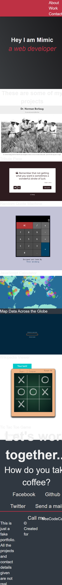

# FCC PORTFOLIO WEBPAGE

> A portfolio webpage built using media queries, semantic elements and advance styling.



## Built With

- HTML5 elements
  - Semantic elements such as `span`, `div`,
- CSS properties
  - CSS Positioning `fixed`,
  - CSS Variables for reusable CSS values,
  - CSS pseudeo class selector such as `:root`,
  - CSS Media Query for page responsiveness using `@media` rule,
  - Typography such as `font-family`, `font-size`, `font-weight` and so on,
  - CSS Background for page aesthetic using `background-color`, `background-image`, `background`.
- Linters
  - [Prettier](https://prettier.io/),
  - [Stylelint](https://stylelint.io/).
- GitHub Action

## Live Demo

[Live Demo Link](https://doc-fcc-portfolio-webpage.netlify.app/)

### Development (Running locally)

- Clone the project

```bash
git clone https://github.com/moshoodabdullahi/fcc-portfolio-webpage.git
```

- Install Dependencies

```bash
yarn install
```

To run StyleLint by itself, you may run the lint task:

```bash
yarn lint:check
```

Or to automatically fix issues found (where possible):

```bash
yarn lint
```

You can also check against Prettier:

```bash
yarn format:check
```

and to have it actually fix (to the best of its ability) any format issues, run:

```bash
yarn format
```

You can also check against webhint:

```bash
yarn hint
```

## Style Guides

- [CSS Style Guide](http://udacity.github.io/frontend-nanodegree-styleguide/css.html)
- [HTML Style Guide](http://udacity.github.io/frontend-nanodegree-styleguide/index.html)
- [Git Style Guide](https://udacity.github.io/git-styleguide/)

## 👤 Author

- Github: [@moshoodabdullahi](https://github.com/moshoodabdullahi)
- Linkedin: [@moshoodabdullahi](https://www.linkedin.com/in/moshoodabdullahi/)
- FreeCodeCamp: [@moshoodabdullahi](https://www.freecodecamp.org/moshoodabdullahi)

## 🤝 Contributing

Contributions, issues and feature requests are welcome!

Feel free to check the [issues page](../../issues).

## Show your support

Give a ⭐️ if you like this project!

## Acknowledgments

- [FreeCodeCamp](https://www.freecodecamp.org/)

## 📝 License

[MIT licensed](./LICENSE).
